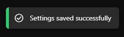
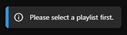
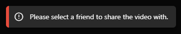

# toast.js

This repo is for a js library for an easy to use toast notification system in javascript.

To install this library simply import the js file

```js
<script src="toast.js"></script>
```

The notification system has 3 notification types, and allows you to configure the Text displayed and the time it stays on screen for.

## Example

Example toast call

```js
toast('success', 'URL Copied', 4000);
```

this call shows this alert on the top right of the screen



there are 2 other error types which are demonstrated below

alert with the "info" setting



alert with the "error" setting



## Configuration

There are 3 configurable notification types, "success", "error" and "info".
